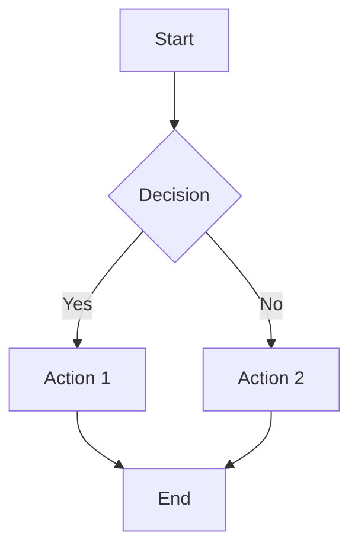
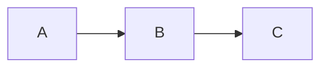
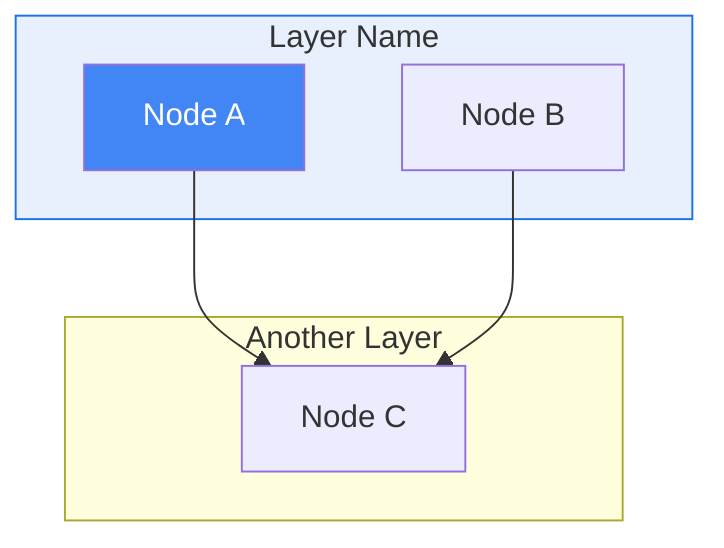

# Mermaid Diagrams

Generate professional diagrams from Mermaid syntax using mermaid-cli.

## Installation

```bash
# Check if installed
which mmdc

# Install if missing
bun install -g @mermaid-js/mermaid-cli
# OR
npm install -g @mermaid-js/mermaid-cli
```

## Quick Reference

| Command | Purpose |
|---------|---------|
| `mmdc -i input.mmd -o output.png` | Generate PNG |
| `mmdc -i input.mmd -o output.svg` | Generate SVG |
| `mmdc -i input.mmd -o output.png -b transparent` | Transparent background |
| `mmdc -i input.mmd -o output.png -w 1400` | Set width (pixels) |

## Workflow

1. Write `.mmd` file with Mermaid syntax
2. Generate image: `mmdc -i diagram.mmd -o diagram.png -b transparent -w 1200`
3. Optionally generate SVG: `mmdc -i diagram.mmd -o diagram.svg -b transparent`
4. Reference in markdown: ``

## Common Diagram Types

### Flowchart (Top-Down)


### Flowchart (Left-Right)


### Subgraphs with Styling


## Styling

### Professional Color Scheme (Recommended)

Use this scheme by default for clean, professional diagrams:

```
%%{init: {'theme': 'base', 'themeVariables': {
  'primaryColor': '#1e293b',
  'primaryTextColor': '#f8fafc',
  'primaryBorderColor': '#334155',
  'lineColor': '#64748b',
  'secondaryColor': '#0ea5e9',
  'tertiaryColor': '#22c55e',
  'background': '#ffffff',
  'mainBkg': '#f1f5f9',
  'nodeBorder': '#cbd5e1',
  'clusterBkg': '#f8fafc',
  'clusterBorder': '#e2e8f0',
  'titleColor': '#0f172a',
  'edgeLabelBackground': '#ffffff'
}}}%%
```

| Color | Hex | Use For |
|-------|-----|---------|
| Slate 800 | `#1e293b` | Primary nodes, headers |
| Sky 500 | `#0ea5e9` | Secondary nodes, highlights |
| Green 500 | `#22c55e` | Success states, confirmations |
| Red 500 | `#ef4444` | Error states, warnings |
| Slate 500 | `#64748b` | Lines, borders |
| Slate 100 | `#f1f5f9` | Backgrounds |

### Alternative: Google Colors Theme
```
%%{init: {'theme': 'base', 'themeVariables': {
  'primaryColor': '#4285f4',
  'primaryTextColor': '#fff',
  'primaryBorderColor': '#1a73e8',
  'lineColor': '#5f6368',
  'secondaryColor': '#34a853',
  'tertiaryColor': '#fbbc04'
}}}%%
```

### Node Styles
```
style nodeName fill:#4285f4,color:#fff,stroke:#1a73e8,stroke-width:2px
```

### Line Styles
```
A --> B           # Solid arrow
A -.-> B          # Dotted arrow
A -->|label| B    # Arrow with label
A -->|"if X"| B   # Arrow with quoted label
```

## Output Format Guidance

| Format | Best For |
|--------|----------|
| PNG | Google Docs, Slack, email, presentations |
| SVG | Web, GitHub, scalable docs |

## Common Options

```bash
mmdc --help  # Full options list

# Key options:
-i, --input      # Input .mmd file
-o, --output     # Output file (format from extension)
-b, --backgroundColor  # Background color (transparent, white, etc.)
-w, --width      # Width in pixels
-H, --height     # Height in pixels
-t, --theme      # Theme (default, forest, dark, neutral)
-c, --configFile # JSON config file for advanced options
```

## Troubleshooting

| Issue | Solution |
|-------|----------|
| `mmdc: command not found` | Install: `bun install -g @mermaid-js/mermaid-cli` |
| Diagram too small | Add `-w 1400` for wider output |
| White background unwanted | Add `-b transparent` |
| Syntax error | Validate at [mermaid.live](https://mermaid.live) |
