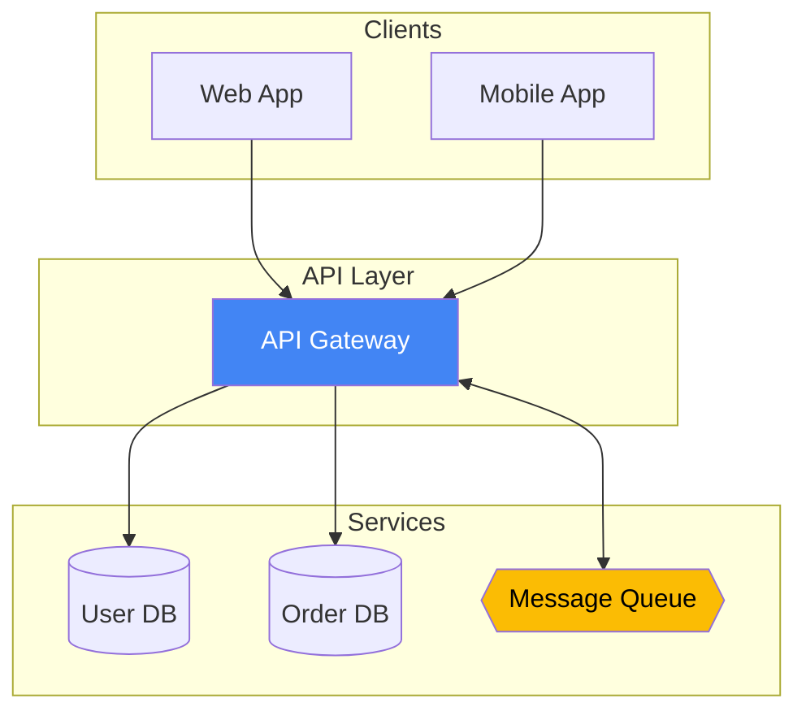
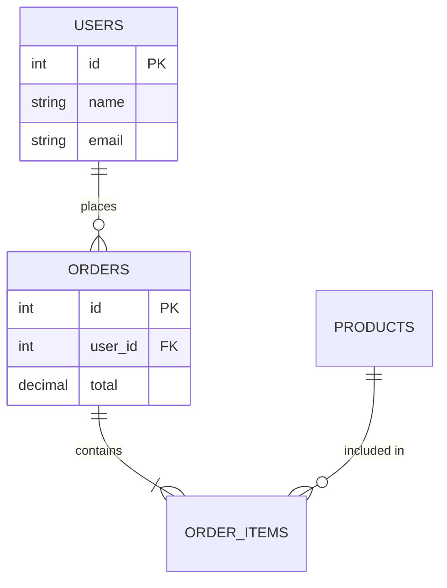
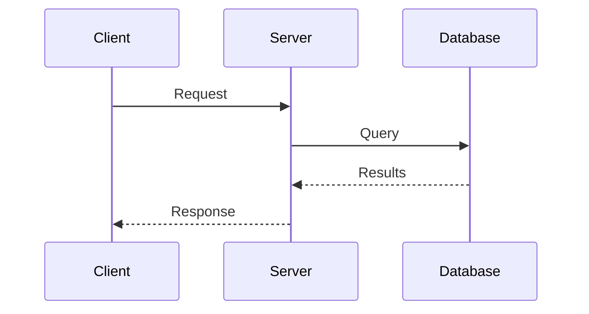

# Mermaid Diagrams

Generate diagrams from Mermaid syntax using mermaid-cli (`mmdc`).

## Quick Reference

| Command | Purpose |
|---------|---------|
| `mmdc -i input.mmd -o output.png -b transparent -w 1200` | PNG with transparent bg |
| `mmdc -i input.mmd -o output.svg -b transparent` | SVG output |
| `which mmdc || bun install -g @mermaid-js/mermaid-cli` | Install if missing |

## Node Shapes

```
[Rectangle]    [(Database)]   {Diamond}      ([Stadium])
[[Subroutine]] {{Hexagon}}    >Asymmetric]   (Round)
```

## Arrow Styles

```
A --> B        # Solid arrow
A -.-> B       # Dotted arrow
A <--> B       # Bidirectional
A -->|label| B # Labeled arrow
```

## Architecture Example



## ER Diagram Example



Relationship notation: `||` (one), `o{` (zero-or-more), `|{` (one-or-more)

## Sequence Diagram Example



## Styling

### Color Scheme
```
%%{init: {'theme': 'base', 'themeVariables': {
  'primaryColor': '#1e293b',
  'primaryTextColor': '#f8fafc',
  'lineColor': '#64748b',
  'secondaryColor': '#0ea5e9',
  'tertiaryColor': '#22c55e'
}}}%%
```

| Color | Hex | Use For |
|-------|-----|---------|
| `#1e293b` | Slate 800 | Primary nodes |
| `#0ea5e9` | Sky 500 | Highlights |
| `#22c55e` | Green 500 | Success |
| `#ef4444` | Red 500 | Error |

### Node Styles
```
style nodeName fill:#4285f4,color:#fff,stroke:#1a73e8
```

## Output Formats

| Format | Best For |
|--------|----------|
| PNG | Docs, Slack, email, presentations |
| SVG | Web, GitHub, scalable docs |

Run `mmdc --help` for all options.

## Troubleshooting

| Issue | Solution |
|-------|----------|
| `mmdc: command not found` | Install: `bun install -g @mermaid-js/mermaid-cli` |
| Diagram too small | Add `-w 1400` for wider output |
| White background unwanted | Add `-b transparent` |
| Syntax error | Validate at [mermaid.live](https://mermaid.live) |
